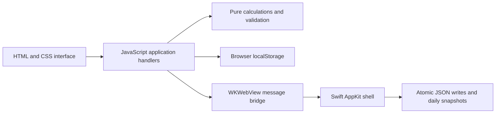

# Momentum

An offline workspace for habits, goals, and projects, built with AI-assisted development and used as a personal productivity tool.

Momentum brings scheduled check-ins, measurable goals, project steps, and notes into one interface. Its JavaScript application runs in a browser or inside a native Swift macOS shell. No account or API key is required.

## Try it in two minutes

1. Download this repository and open `Try-Momentum.html` in a modern browser.
2. Select **Settings & backup → Explore demo workspace**.
3. Visit **Projects**, open a sample project, and complete a step. Return to **Overview** to see the progress change.
4. Select **Return to my workspace**. The sample workspace is temporary and separate from saved data.

The browser preview saves your real workspace in that browser. Browser storage and desktop storage are separate; use JSON export/import to transfer a workspace.

## What it demonstrates

- **Workflow design:** habits have schedules; projects have steps, priorities, deadlines, and explicit completion states.
- **Data quality:** imported JSON is validated before a confirmation step replaces the workspace.
- **Persistence and recovery:** the desktop app writes atomically and keeps the newest 30 daily snapshots; save failures remain visible.
- **Explainable metrics:** habit consistency excludes unscheduled days, goal progress is capped at 100%, and reopened tasks change project completion.
- **User control:** local data, manual exports, search, activity history, and a separate demonstration mode.

## Architecture



`Resources/core.js` owns calculations and validation. `Resources/app.js` owns application state and UI events. `Native/main.swift` provides the window, menus, file dialogs, local persistence, and the message bridge.

AI assisted development of this app. Its runtime insights and metrics are rule-based; it does not call an LLM or send workspace data to a server.

## Run the desktop app

Requires macOS 13 or later and Apple's Swift compiler through Xcode or Command Line Tools.

```sh
bash Install-Momentum.command
```

The installer builds and ad-hoc signs the app, places it in `~/Applications/Momentum.app`, and opens it. An existing installation is moved to a timestamped backup. Your workspace lives separately in `~/Library/Application Support/Momentum/`.

This is a source-built personal application, not a notarized distribution. See [the user guide](START-HERE.txt) for storage, backup, metrics, and shortcut details.

## Tests

With Node.js 22 or later:

```sh
node --test Tests/*.test.cjs
```

The existing tests cover schedule boundaries, streaks, leap years, malformed backups, task transitions, persistence, demo isolation, and native save acknowledgments. The handler harness does not replace browser or macOS integration testing. See [verification](docs/verification.md) for the checks actually performed on this portfolio copy.

## Scope and tradeoffs

This is a single-user tool with local storage and portable JSON backups. There is no cloud sync, team collaboration, authentication service, or LLM integration. Activity history describes changes but is not an immutable compliance audit log.

Daily personal use is qualitative evidence of usefulness. No measured time-savings or multi-user adoption claim is made. A useful next evaluation is a timed comparison of planning and updating the same project in Momentum and the prior workflow.
